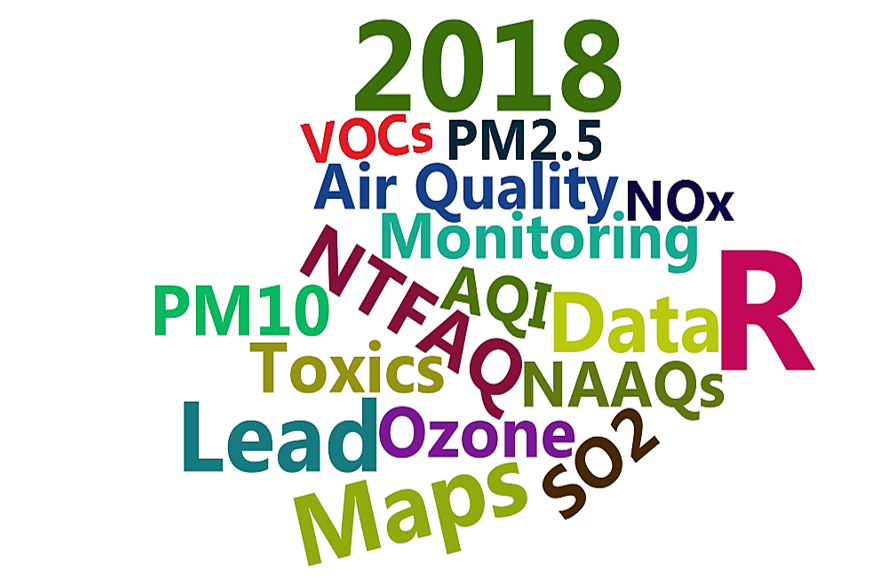

---

# Name your table

If you want to work with the data in R, you will need to give it a name by using the assignment operator `<-`. 

Try the code below. 
```{r cat_csv_name}

my_cat_file <- "data/my_cats.csv"

my_cats <- read.csv(my_cat_file)

# Type the name of the table to view it in the console
my_cats

```


#| Add a new `package` &#x1F4E6;
<hr>

> __What is a package?__

A _package_ is a small add-on for R, like a phone App for your phone. They add capabilities like statistical functions, mapping powers, and special charts. In order to use a new package we first need to install it. 

__Key terms__  

`package` An add-on for R that contains new functions someone created to help you. It's like an App for R.  
`library` The name of the folder that stores all your packages, and the function used to load a package.

#|Take a mean here


#|Time series plot

#|Monthly Box Plot


#_Explosion!_ 
>You receive new data that were measured during and near a petroleum refinery explosion. You are told that you will receive weekly updates of data, and that communities will want to watch how the data change over time. 

#Now we can just re-bind_rows and we're off!

#Quick Map
# Data exploration
<hr>


# It's inspector time!
Was there an air impact from this explosion?

{align="right" width=250 style="-webkit-transform: scaleX(-1); transform: scaleX(-1); margin-right: 80px; margin-top: -10px"}


__Script comments__

Add a brief description of your new case to the top of the script using the comment symbol `#`.
To add the data to the pollution rose:
# Find the file's location

Open this URL in your browser https://github.com/MPCA-air/RCamp/tree/master/data, and find the file `missing_cat_list.csv`. To download, __Right click__ on your cat's file and select __Save Link As...__. Navigate to your project folder and save the file into a folder named `data\`. Don't have a `data` folder? Go ahead and create a new one.  


## Add the file location to your script {-}
Now you can paste the file's location into the `read_csv()` function. Here's a code snippet to get you started.

### <i class="fa fa-user-secret" aria-hidden="true" style="color:#040707;"></i> Pro-tip! {-}

#| __dplyr__
<hr>

{width="120" align="left" style="margin-right: 20px; margin-top: 8px"}

<br>

_You've unlocked a new package!_  

The _dplyr_ package is the go-to tool for exploring, re-arranging, and summarizing data.  

<br><br>

Use `install.packages("dplyr")` to add _dplyr_ to your detective library.  

<br>


__Quick stretch break  <i class="fa fa-hourglass-half" aria-hidden="true" style="color:#040707;"></i>__ 

<br>


__Your analysis toolbox:__ The key _dplyr_ functions

| Function      | Returns                                             |  
|:--------------|:----------------------------------------------------|  
| `select()`    | select individual columns to drop, keep, or reorder |  
| `arrange()`   | reorder or sort rows by value of a column           |  
| `mutate()`    | Add new columns or update existing columns          | 
| `filter()`    | pick a subset of rows by the value of a column      | 
| `group_by()`  | split data into groups by values in a column        |  
| `summarize()` | calculate a single summary row for the entire table |   

<br>


#| `filter()`
<hr>

The `filter()` function creates a subset of the data based on the value of one or more columns. Use `filter()` to answer the questions below.

<br>

_What are the cat names that are only 1 year old?_

```{r filter12, eval = F}

filter(all_cats, age == 1)

```


# Comparisons

To use filtering effectively you’ll want to know how to select observations using various comparison operators.

_Key comparison operators_

| Symbol| Comparison               |  
|:----|:------------------------|  
| `>`   | greater than             |  
| `>=`  | greater than or equal to |  
| `<`   | less than                |  
| `<=`  | less than or equal to    |  
| `==`  | equal to                 | 
| `!=`  | not equal to             | 
| `%in%`| value is in a list       | 
  

<br> 


<div>
{align="left" width="240" style="margin-right:40px;"}
</div>

__Create a new R script that answers a few questions about your data set: __

1. How many rows are in your data set?
1. What are the column names?
1. Find a mean of a single column.
1. Use `group_by()` to summarize()` the values of a column based on a group it's in. 
1. Use `mutate()` to convert one of your columns into a different unit (e.g. `lbs` to `Millions of lbs` or `grams` to `kilograms`).
1. `filter()` your data to a single category.
1. Use `%in%` to filter your data to a few categories. 
1. Make up a question of your own and try to answer it using the data.


> _Did answering these questions raise new questions about your data?_


# Let's work together <span style="font-size: 1em;"><i class="fa fa-group" aria-hidden="true" style="color: steelblue;"></i></span>

<br>

__We're all air monitoring folks, data analysts, and all around air protectors. But a great reason to learn R is the jokes.__ 


```{r, include=F, eval=F}
library("yarrr")
library("wordcloud")
library("wordcloud2")
library("dplyr")

set.seed(2)


names <- c("AQI", "NTFAQ", "Monitoring","Data","Air Quality","NAAQs", "Toxics", "Ozone", "PM2.5", "PM10", "NOx", "VOCs", "SO2", "R","Maps","Lead","2018")

frequency <- c(c(1,1,1,1,1, 1, 1, 1, 1, 1, 1, 1,1 ,1 ,1, 1)*8, 14,10,11)

frequency <- c(as.numeric(sample(8:12, 13, replace = T)), 24,14,14,18)

pirates <- piratepal("info2") 

wordcloud(names, 
          random.order = F, 
          random.color = TRUE, 
          scale        = c(4,1), 
          freq         = frequency, 
          colors       = pirates, 
          vfont        = c("sans serif","bold"), 
          rot.per      = 0.2,
          size         = 0.1)

wordcloud2(data.frame(word = names, freq = frequency), size = 1, color = 'random-dark')

#letterCloud(data.frame(word = names, freq = frequency), word = "R", color = 'random-light', wordSize = 10)

```




# Let's work together <span style="font-size: 1em;"><i class="fa fa-group" aria-hidden="true" style="color: steelblue;"></i></span>


__Here's one:__  _What'tis the pirate's favorite letter?_


{width="320"}


> _Just kidding. You'd think it'd be R, but 'tis the __C__ they truly love._


<div class = "note">
Resources come and go.
R is free and there is a lot of help out there.
Let's work together and pool our resources!
Share ideas, analysis, code, data, and collaborate. Make bad R jokes?  
</div>
<br>


In the garage

# Open R Studio

> RStudio is a handy user interface we use to write R scripts/recipes and keep our projects organized. It isn't required to use R, but it makes things easier.


# A tour of R Studio


__1. Code editor__ 

This is where you write your scripts and document your work. The tabs at the top of the code editor allow you to view scripts and data sets you have open. This is where you'll spend most of your time.
 
__2. Console__ 

This is where code is actually executed by the computer. It shows code that you have run and any errors, warnings, or other messages resulting from that code. You can input code directly into the console and run it, but it won't be saved for later. That's why we like to run all of our code directly from a script in the code editor.
 
__3. Workspace__ 

This pane shows all of the objects and functions that you have created, as well as a history of the code you have run during your current session. The environment tab shows all of your objects and functions. The history tab shows the code you have run. Note the _broom_ icon below the Connections tab. This cleans shop and allows you to clear all of the objects in your workspace.
 
__4. Plots and files__ 

These tabs allows you to view and open files in your current directory, view plots and other visual objects like maps, view your installed packages and their functions, and access the help window. If at anytime you're unsure what a function or package does, enter the name of thing after a question mark. For example, try entering `?mean` into the console and push __ENTER__.


# Process the data
> Another package that we use all the time to pull together datasets or summarize datasets is called _dplyr_.

```{r, eval=F}
install.packages("dplyr")
library(dplyr)

names(data_2015)
nrow(data_2015)
glimpse(data_2015)
summary(data_2015)
#corrplot(data_2015)
```


#| Naming things
First, you need to know a little bit about what you're seeing in the code editor window.
Everything in R has a name.
When you are working on a table in R, you are not changing the original Excel file data, you are working on the object that you named.
<hr>

You can create objects and assign values to them using the "left arrow" `<- `, more officially known as the assignment operator. 


```{r steps, eval = F}

# Create a new object
cat <- "Mr Puddles"

cat

# You can copy an object by saving it to a new name.
cat2 <- cat

# Overwrite an object
cat <- "Clawy"
  
cat

#We named our data
```

Once you add the code to your script, you can run the code by moving the blinking cursor to that line and pressing __CTRL + ENTER__.

#|Deleting things is fun and easy
<br>

If you create a name you don't like you can drop it with the function `rm() `.
```{r, eval = F}

# Delete objects to clean-up your environment
rm(cat)

rm(cat2)


# Now, how do I get the 'cat' object back?


```

<br>


<div class="tip">

__HOORAY!__  Don't worry about deleting data or making a mistake in R. When you load data files into R it only copies the contents. That means all your original data files will remain safe and won't suffer from any accidental changes. If anything disappears or goes wrong in R, it's okay! You can always re-load the data using your script. No more worries about whether you remembered to save the latest data file or not.
</div>

<br>


# Functions

{align="right" width="280" style="margin-left:25px; margin-bottom: 60px;"}

Now that you know what objects are and how to create them, let's learn how to use them. Functions take one or more inputs called "arguments". They perform steps based on the arguments and return an output object. 

<br>

You can think of a function like ordering pizza.

```{r, eval=F} 

order_pizza(address  = "140 3rd place, Bingo MN", 
            toppings = c("mouse whiskers", "catnip", "anchovies"), 
            time     = "ASAP")

```

<br>

The function above calls a pizza place and provides several arguments (your address, pizza toppings, and delivery time). With some luck, the function will sucessfully return a new object (your cat's favorite pizza). Note that when you have more than one argument, you will use a comma to separate them.
