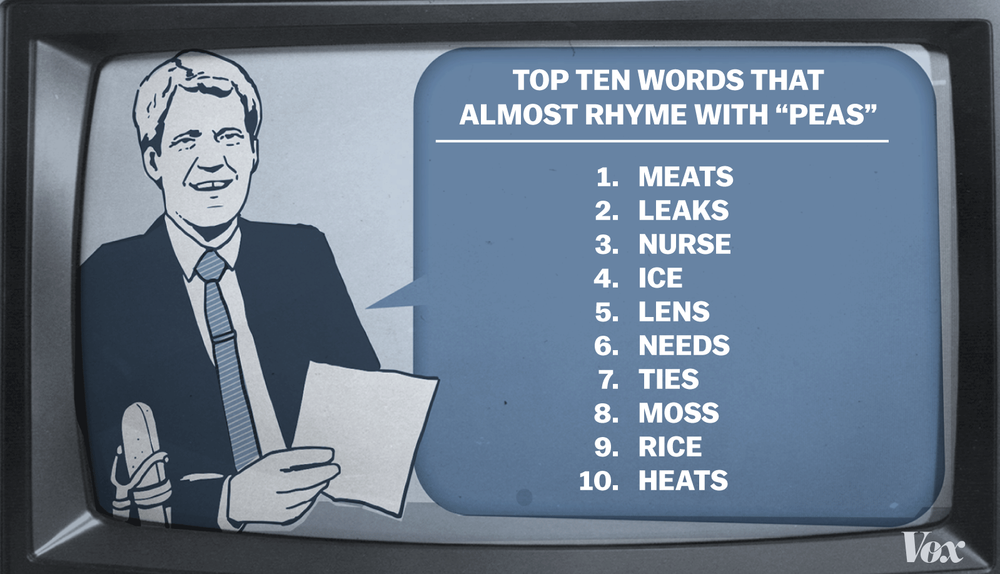

class: inverse

# How do I analyze my data?

<br>

--

## ...and not want to throw my computer in the lake?

--

## ...the same way as you do?

--

## ...and be able to check my answers?

## ...and remember what I did 2 years ago?


--

## ...while you're sleeping?


---
class: inverse

# .scary[R training is coming this Fall...]

```{r setup, include=F, message=F, warning=F}
# Details on R presentations https://support.rstudio.com/hc/en-us/articles/200486468
options(htmltools.dir.version = FALSE)
knitr::opts_chunk$set(echo = TRUE, error = TRUE)
htmltools::tagList(rmarkdown::html_dependency_font_awesome())

```


---
class: middle, center

.work[__THIS IS A TRUE STORY__]


<br>

.fade[
The __events__ depicted took place in __Minnesota__ in 2015. Dates and locations may have changed to protect the innocent. The rest is told __exactly__ as it occurred.
]


---
class: white, center
background-image: url("http://blogs.reed.edu/datablog/files/2015/09/RStudio-Ball.png")
background-position: 50% 50%
background-size: 87%


.lower[.center-text[
# is community sourced
]]


---

<div style="margin-top: -20px;">
.center[]
</div>

People all around the world contribute to and maintain R. A main focus is making it friendlier and easier to use. 

Imagine 1,000's of graduate students, non-profits, scientists, and data enthusiasts all working to provide you with tools to help analyze and visualize your data. 

.center[This is happening __RIGHT NOW__.]

---

# Top 10 reasons to use R

.center[

]

<br>

The following slides contain our 10 favorite things about R. R almost rhymes with _share_.


---

# 1| Dynamic tools


[](https://air-data.shinyapps.io/Metro_shiny_roses/)


.work[It all started with a [Pollution Rose](https://air-data.shinyapps.io/Metro_shiny_roses/).]


---
class: middle


<div class="note">

Soooo, we were hooked. <br><br>

We began learning R and we were no longer at the whims of changing budgets because...

</div>

<br><strong><i>...Drum roll please...</strong></i><br>


```{r, eval=F, include=F}
.center-text[
A data analysis group from Indiana was using R to show facilities their potential contribution to air exceedances by using R based dynamic tools like the one above.]

<div class="note">

Our agency had recently lost funding for the statistical software SPSS. It took us months to process our air toxics data because we had so many monitors and pollutants to process.

We saw R as a powerful way to automate our work. 
</div>
```


---

# 2| **R is FREE!**

--

__Let's install R.__ [Click here!](https://mpca-air.github.io/NTF_learn_R/00_Install.html)

__You can download R right now. We will wait.__


--

<div class="note"> Ok, but how does R work?</div>

R lets you perform data analysis like you're writing a recipe for chocolate chip cookies. Once you've written your favorite recipe you can use it over and over again or share it with your favorite collaborators and grandkids. 

.center[]

---

# A data recipe 

<br>

### __Summarized air data__

.smalltext[
_Servings: 1 to 10_
]

1. Read the monitoring data in from AQS

2. Look at a plot of the data.

3. Remove the bad data.

4. Make an even better plot of the data.

5. Summarize the data.

6. Save the results.

---

# Our story Begins


__It's your first day on the job.__ 

_And you've got new data._

--

You are given a laptop with one folder on it. In the folder is a single Excel file. Shortly after sitting down you receive a phone call. The person on the other end of the phone tells you that the data set isn't complete and will be updated on a weekly basis. Also, there is a potential need for weekly data analysis updates.

_(You think briefly about your brother who sells ice cream on a beach and wonder what that would be like)._  

__MISSION IMPOSSIBLE begins.__ 


---
class: inverse, center, middle


.bigtext[We've got data.] 

--
<br>
.bigtext[Now how do we get it into R?]

--
<br><br>
_Pfff... I don't know. Do you?_ 

--
<br><br>
__Let's Google it!__


---


---

# 3| There's a new package waiting for you


When someone shares their analysis recipe or new tool in R, they wrap everything together into a __package__. Packages in R are like Apps for your phone -- you load them each time you want to do something special.


<br>

Since this data is stored in an Excel file we can load the __readxl__ package, which gives R the power to read data from Excel. 


```{r, eval=F, message=F, warning=F}
install.packages("readxl")
```

```{r, eval=T, warnings=F, message=F, warning=F}
library(readxl)
```

```{r, eval=F, message=F, warning=F}
data <- read_excel("data.xlsx", sheet = "2014")
```


---

# Package stickers 


__readxl__ is only one of many helpful R packages out there. Here's a sample of our favorites.

We have lots of stickers and you should take some with you. Many are for a variety of R communities.

---


# 4| Read all kinds of data

These packages give R the ability to read data in from almost any place it might be stored. R can talk to SQL databases, read data saved from other statistical software, or pull data directly from the internet.

--

### Places to get data

- AirNow

--

- AQS

--

- NOAA

--

- Dropbox

--

- FTP sites

--

- SQL databases

--

- .scary[Floppy disks]


--

__Let's try it.__


---

# Back at our day job. 

First take a gander at the data. It's sitting online [HERE](https://github.com/MPCA-air/NTF_learn_R/raw/master/data/PM_and_Ozone/Hourly_Fond_Du_Lac.xlsx).

--

Now load the Excel data into R:

`1.` Download the file:
```{r, eval=F, message=F, warning=F}
download.file("https://github.com/MPCA-air/NTF_learn_R/raw/master/data/PM_and_Ozone/Hourly_Fond_Du_Lac.xlsx", "data/Fond_data.xlsx", mode = "wb")
```

`2.` Read the __2014__ tab:
```{r, message=F, warning=F}
data_2014 <- read_excel("data/Fond_data.xlsx", sheet = "2014")
```


`3.` Read the __2015__ tab:
```{r, eval=T, message=F, warning=F}
data_2015 <- read_excel("data/Fond_data.xlsx", sheet = "2015")
```


---

# 5| Read all the rows

What if you have a ** _HUGE_ ** file? 

<br>

Good timing! We just requested MET data from the weather people down the hall, and they sent us a text file with over million rows of data. 

That's nice of them, but _don't they know_ Excel is limited to around a million rows?

---

## We will open it.

Here's what we do to read a large text file:


`1.` Download the file:
```{r, echo=T, eval=F, cache=T, message=F, warning=F}
url <- "https://github.com/MPCA-air/NTF_learn_R/raw/master/data/PM_and_Ozone/BIG_MET_data.zip"

download.file(url, "data/BIG_MET_data.zip")

# It's a zip file, so we can run the unzip() function
unzip("data/BIG_MET_data.zip", file = "MET_data_2012-2017.csv")
```

```{r, eval=F, echo=T, message=F, warning=F}
install.packages("readr")
```


`2.` Read the data with __ ` read_csv() ` __:
```{r, echo=T, eval=F, message=F, warning=F, results='hide'}
# Inside the ZIP file is a huge csv text file.
# For this we can run read_csv() from the readr package.
# This package has lots of data reading functions.

library(readr)

big_met <- read_csv("MET_data_2012-2017.csv")
```

```{r, include=F, eval=T, results='hide', warning=F, message=F}
# Inside the ZIP file is a huge csv text file.
# For this we can run read_csv() from the readr package.
# This package has lots of data reading functions.

library(readr)

big_met <- read_csv("MET_data_2012-2017.csv")
```


---

# Did it work?


### How many rows are there?
```{r, eval=T}
nrows(big_met)
```


We can look at the data in a couple of ways:
```{r, eval=F, echo=T, message=F, warning=F}
#This package has lots of data processing functions.
install.packages("dplyr")
```

```{r, eval=T, include=F}
library(dplyr)
```

---

# `glimpse()` the data

```{r, eval=T, echo=T, message=F, warning=F}
library(dplyr)

glimpse(big_met)
```

<br>

---

# `summary()` of all columns

```{r, eval=T, echo=T, message=F, warning=F}

summary(big_met)
```

---

# ` filter() ` to a single site


```{r, echo=T, eval=T, message=F, warning=F}
library(knitr)

# The filter() function is in the package dplyr
fonddulac_met <- filter(big_met, site_catid == "27-017-7417")


kable(head(fonddulac_met, 5), 'html')
```


---

# 6| Join related data tables with 1 line

Since our concentration data has the same format and only the year is changing, we can bind the two tables together with the function `bind_rows()`.

```{r, eval=T, echo=T, message=F, warning=F}
air_data <- bind_rows(data_2015, data_2014)
```

```{r, eval=F, echo=T, message=F, warning=F}
install.packages("lubridate")
```

```{r, eval=T, echo=T, include=F, message=F, warning=F, results='hide'}

# Format the dates for both tables
library(lubridate)

air_data$date_time <-  paste(ymd(air_data$Date), hms(paste(air_data$Hour, ":00:00")))

air_data$date_time <-  ymd_hms(air_data$date_time)

fonddulac_met$time <- ymd_hms(fonddulac_met$time)

fonddulac_met$site_catid <- NULL

```


---

We can `left_join()` the weather and concentration data by the __date__ column in each table.

```{r, echo=T, eval=T, message=F, warning=F}

air_met <- left_join(air_data, fonddulac_met, by = c("date_time" = "time"))
```

_We didn't join on site identification codes because the sites in the MET and AQS data have different IDs._


Here's what the first few rows look like.
```{r}
library(knitr)

air_met <- arrange(air_met, -Date)

kable(head(select(air_met, -date_time, -Time, -icon), 1), 'html')
```


```{r, eval=T,  include=F, message=F, warning=F}
write_csv(air_met, "air_met.csv")
```


---

# 7| Documentation and transparency


.indent[
## **To do list**

1. Analyze data
2. ?
3. ??
]

Documentation is hard work and much of my documentation looks like the above list. But in R, I have written each step into a text file script and __voila!__ There's documentation for myself and others.

<div class="tip">

.pad-right[
You are encouraged to copy and share analyses and charts with others.

It's especially fun to copy yourself from 2 years ago.
]
</div>


---

# 8| You can't break your data

<div class="quiz">

.work[
## Pop Quiz, hotshots!  

<br>
<strong>Which of these things have we done?</strong><br>
<i>(Hint: It may be more than one of them.)</i>
]


<input type="radio"> Lost a data file. <br>
<input type="radio"> Accidently replaced a value in Excel with a random letter like 'z'. <br> 
<input type="radio"> Forgotten which file housed the original data. <br> 
<input type="radio"> Saved over something important. <br> 
<input type="radio"> Lost an entire folder of data.  <br>
<input type="radio"> Forgotten which monitoring days I dropped and why. <br>

</div>


---

# 8| You can't break your data


So far we have joined a table of MET data with concentration data, and the original data files have not been changed. The raw data is still safe.

When we receive updated data we can run the same script to append the data and proceed with our analysis.


You will notice that when we're in R, we always use a name for the data and then tell R to do something to the named object.

It looks like this:

```{r, eval=F}
data <- read_excel("data.csv")
```

These R commands always act on a **copy** of the data and aren't changing the original file. So no more worries! 

To look at subsets of data or to store summary results we can create copies of things in the R environment, all without creating lots of different copies of the data.


---

# 8| You can't break your data

If you want to create data from scratch, give the value a name. 


Let's make some values for the temperature and this conference.
```{r, echo=T, eval=T, message=F, warning=F}
current_temp <- 70

this_conference <- "NTFAQ"
```

<br>

Now when we type the names into the R console it will tell us what is stored there.

Hey R, what's the `current_temp`?

```{r, echo=T, eval=T, message=F, warning=F}
current_temp
```


--

__Thanks R!__


---

# 9| Missing values

Let's look at a `summary()` for PM2.5 concentrations and wind speed.


```{r, echo=T, eval=T, message=F, warning=F}

# The summary() function provides min, max, means, etc of each numeric variable in the data set.
# It also tells us what each column type is, letting you know whether the data is
# stored as characters, integers, decimals, or date objects.

select(air_met, Conc, windSpeed) %>% summary()
```

You can see the mean of the "Conc" column and we see no missing values.

If we look at the summary for wind speed, we see many missing values (shown as ` NA ` in R).
We need to know this. We don't want to take means of data where most of it is missing. Other programs may ignore these values, or throw an error at you.

---

# 9| Missing values


<div class="note">
But I only want one number. Is that too much to ask!?
</div>

```{r, echo=T, eval=T, message=F, warning=F, results='hide'}
# The summarize() function reduces your data down to a statistical summary
# mean(), max(), min(), percentile(), range(), etc.

fonddulac_mean <- summarize(air_met, mean_pm25 = mean(Conc, na.rm = TRUE))

fonddulac_mean
```


Okay, here's your answer _(if we drop all the `NAs`)_.

The average PM2.5 concentration is:  __.scary[.bigtext[`r round(fonddulac_mean$mean_pm25, 3)` _ug/m3_]]__


---

# 10| Any plot for any data


<br>

The _ggplot2_ package has functions that can make almost any plot you can think of. It can also layer plots on top of each other to add multiple elements.

__The fun will start now.__ `r icon::fa("rocket", animate="spin")`

```{r, echo=T, eval=F, include=F, message=F, warning=F}
install.packages("ggplot2")
```


---
class: inverse

# The classic `geom_bar()` plot
```{r, echo=T, eval=T, message=F, warning=F, out.height="410px", out.width="450px"}
library(ggplot2)

ggplot(data = air_met, aes(x = site_catid, y = Conc)) +
   geom_bar(stat = "identity")
```

It looks like one mean might be higher than the other, but we can't really tell until we can see more of the data.

---

# Box plots

```{r, echo=T, eval=T, message=F, warning=F, out.height="410px", out.width="500px"}
ggplot(data = air_met, aes(x = site_catid, y = Conc)) +
geom_boxplot()
```

---

# More box plots

Let's add some color and __ALL 25,000__ of the original data points.

```{r, echo=T, eval=T, message=F, warning=F, out.height="420px", out.width="500px"}
ggplot(data = air_met, aes(x = site_catid, y = Conc, fill = site_catid)) +
   geom_boxplot() +
   geom_jitter(alpha = 0.03)
```

---

# Calendar plot

```
library(openair)

air_met <- airmet %>%
select(datetime, Conc) %>%
rename(date = datetime)
#openair requires dates to be stored under field name "date"

calendarPlot(air_met, pollutant<- "Concentration", statistic="mean", year = 2015, annotate="value", digits=1, key.footer="ug/m3", main="Daily Average PM2.5 Concentrations in Fond Du Lac, 2015")

```


---

# beeswarm
```{r, eval = F}
library(ggbeeswarm)

  
  data = mutate(data, AQSID = as.factor(AQSID) )
  ggplot(filter(data, Pollutant == pollutant, Year == year), aes(y = AQSID, x = Result, color = Censored) ) + 
    geom_quasirandom(groupOnX = F) +   
    labs(title = paste(pollutant, year), x = "Result (ug/m^3)" )
```

---

# Time series

```
ggplot()
```

---

# Nature journal

```
ggpomological()
```

---
class: inverse, middle, center

# Chart finale...

---

# .work[the **XKCD** plot]

```
ggplot()
```

---

# 10.5|  R gives you a language for data

It's nice to have words. 

How would you describe going from data in a __wide__ format to data in a __tall__ format?

<br>

A collection data words:

- gather
- spread
- mutate
- filter

---

# 11| Automate - _update with new data_

__Explosions!!!__

.center[

]


There was a big refinery explosion close to our monitoring site. We'll be receiving new monitoring data in the next hour. We need to let people know if anything suggests smoke from the explosion is reaching the air monitor.

---

# 11| Automate - _update with new data_


We have data for 2014 and 2015, but the explosion just happened now _(in the year 2016)_. Remember our data is stored in one Excel workbook. Since we wrote this in a script form we can change the date in our `read_excel()` to __2016__.

```{r, echo=T, eval=T, message=F, warning=F}
download.file("https://github.com/MPCA-air/NTF_learn_R/raw/master/data/PM_and_Ozone/Hourly_Fond_Du_Lac.xlsx", "data/Fond_data.xlsx", mode = "wb")

data_2016 <- read_excel("data/Fond_data.xlsx", sheet = "2016")

```


We changed the _year_ and __BOOM!__ we've got updated data.

---

# Update the charts and roses

Now we can follow the same steps we used before to bind the tables togehter and join the MET data.


```{r, echo=T, eval=T, message=F, warning=F}

air_data <- bind_rows(data_2014, data_2015)
```


Then we join the met data:
```{r, eval=T, include=T, message=F, warning=F}

# Set date formats
air_data$date_time <-  paste(ymd(air_data$Date), hms(paste(air_data$Hour, ":00:00")))

air_data$date_time <-  ymd_hms(air_data$date_time)

# Join
air_met <- left_join(air_data, fonddulac_met, by = c("date_time" = "time")) %>% select(-Time)

# View table
kable(head(air_met, 5), 'html')
```

---

# 12| Make maps and never get lost again

Where is the Fond Du Lac monitor again? 

Was it close to the explosion? 

--

Let's take a look.

```{r, eval=F, echo=T, include=F, message=F, warning=F}
install.packages("leaflet")
``` 


```{r, eval=F, echo=T, message=F, warning=F}
library(leaflet)

# Reduce the table to a single row for each monitoring site
air_sites <- group_by(air_met, site_catid) %>% slice(1)

# Quick interactive map
leaflet(data = air_sites) %>%
   addTiles() %>%
   addMarkers(label = ~as.character(SiteNum), 
              labelOptions = labelOptions(noHide = T))
``` 

<br>

__Go-Go gadget leaflet!__


---

# 12| Make maps and never get lost again

<br>

```{r, eval=T, echo=F, message=F, warning=F, out.width="78%"}
library(leaflet)

# Reduce the table to a single row for each monitoring site
air_sites <- group_by(air_met, site_catid) %>% slice(1)

# Quick interactive map
leaflet(data = air_sites) %>%
   addTiles() %>%
   addMarkers(label = ~as.character(SiteNum), 
              labelOptions = labelOptions(noHide = T))
``` 

---

# 12| Make maps and never get lost again

#### Let's add where we are right now.

--

```{r, eval=T, echo=F, message=FALSE, warning=FALSE, out.width="78%"}
library(leaflet)

# Reduce the table to a single row for each monitoring site
air_sites <- group_by(air_met, site_catid) %>% slice(1)

# Quick interactive map
leaflet(data = air_sites) %>%
   addTiles() %>%
   addMarkers(label = ~as.character(SiteNum), 
              labelOptions = labelOptions(noHide = T)) %>%
    addPopups(-92.478, 46.6659,
              "<b><a>You are HERE</a></b>",
              options = popupOptions(closeButton = FALSE))
``` 


---


# Return of the roses

Remember the first pollutant rose we looked at? Let's load the Fond Du Lac data set into the tool to see if the refinery explosion could have potentially impacted the PM2.5 concentrations.

[Pollution rose for any data](https://air-data.shinyapps.io/pollution-roses/)


---

# 13| Online community + Us + You


.bigtext[**Join the R community**]

.float-left[

]

.float-right[

- #### `#rstats` Twitter
- #### Local R User groups
- #### Online courses and blogs: Coursera, Data Camp, Kaggle
- #### R conferences _(all types of data)_
- #### RLadies Global

.center[

]

]


---

# 14| It will compliment you and make jokes 

There are some _just for fun_ R packages. 

```{r, eval=F, echo=T, include=F, message=F, warning=F}
install.packages("cowsay")
install.packages("fortunes")
``` 

_cowsay_ outputs a variety of animals saying the quotes of your choice.

```{r, echo=T, eval=T, message=T, warning=F}
library(cowsay)
say("Meowww. You deserve a break.", "cat")
```


---

# Congratulations! 


You've completed the Super fast R Intro and are ready for Day 1 of R Camp. 

In the mean time you can find help on _R-Bloggers_, download the package _swirl_, Google R related questions, or take this [Coursera](https://www.coursera.org/specializations/jhu-data-science) course.


There's also an R intro for __pirates__. If you are a pirate you can sail the high seas [Here](http://tryr.codeschool.com/).

We want to meet you. Come talk to us. Send us an e-mail. 

We are  [Kristie.Ellickson@state.mn.us]() and [Dorian.Kvale@state.mn.us]()

We like __R__. We aren't computer scientists and you don't need to be either.


---

# Back to GitHub

This presentation was made with `Rmarkdown` and Yihui's ` xaringan ` package. 

Return to the project's [GitHub page](https://github.com/MPCA-air/NTF_learn_R).

<br><hr>


<br><hr>


