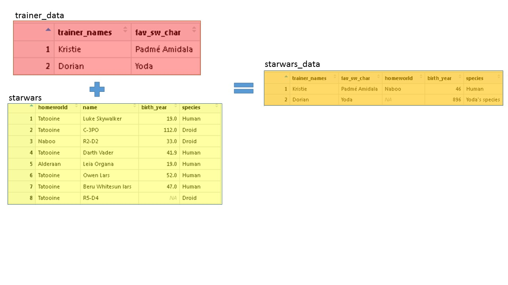

class: inverse

# .bigtext[How can I analyze my data?]

--
<br>
.bump-right[
## ...and not want to throw my computer in the lake?
]

--
<br>
.bump-right[
## ...and be able to show someone what I did?
]

--
<br>
.bump-right[
## ...and have it still make sense 2 years from now?
]

---
class: inverse

# .scary[R training is coming this Fall...]
```{r setup, include=F, message=F, warning=F}
# Details on R presentations https://support.rstudio.com/hc/en-us/articles/200486468
options(htmltools.dir.version = FALSE)
knitr::opts_chunk$set(echo = TRUE, error = TRUE)
htmltools::tagList(rmarkdown::html_dependency_font_awesome())

```

.fade[.center[

]]


---
class: inverse

# R Camp

.center[
<a href="https://mpca-air.github.io/RCamp/">
</a>
]


---
class: inverse

# Air data methods

.center[
<a href="https://mpca-air.github.io/air-methods/">
</a>
]


---
class: white, center
background-image: url("http://blogs.reed.edu/datablog/files/2015/09/RStudio-Ball.png")
background-position: 50% 50%
background-size: 87%


.lower[.center-text[
# is community sourced
]]


---

<div style="margin-top: -20px;">
.center[]
</div>

.center[ __R is spreading.__]

People all around the world contribute to and maintain R. A main focus is making it friendlier and easier to use. 

Imagine 1,000's of graduate students, non-profits, scientists, and data enthusiasts all working to provide you with tools to help analyze and visualize your data. 


---
class: center, middle


# Top 10 reasons to use R


<br><br>


---

# 1| Dynamic tools


[](https://air-data.shinyapps.io/Metro_shiny_roses/)


.work[It all started with a [Pollution Rose](https://air-data.shinyapps.io/Metro_shiny_roses/).]


---
class: middle


<div class="note">

We began learning R and we were no longer at the whims of changing budgets because...

</div>

<br><strong><i>...Drum roll please...</strong></i><br>


```{r, eval=F, include=F}
.center-text[
A data analysis group from Indiana was using R to show facilities their potential contribution to air exceedances by using R based dynamic tools like the one above.]

<div class="note">

Our agency had recently lost funding for the statistical software SPSS. It took us months to process our air toxics data because we had so many monitors and pollutants to process.

We saw R as a powerful way to automate our work. 
</div>
```


---

# 2| **R is FREE!**

--

__Let's install R.__ [Click here!](https://mpca-air.github.io/NTF_learn_R/00_Install.html)

__You can download R right now. We will wait.__


--

<div class="note"> How does R work?</div>

--

R lets you perform data analysis like you're writing a recipe for chocolate chip cookies. Once you've written your favorite recipe you can use it over and over again or share it with your favorite collaborators and grandkids. 

.center[]

---

# A data recipe 

<br>

### __Summarized air data__

.smalltext[
_Servings: 1 to 10_
]

1. Download monitoring data from AQS.

2. Look at a plot of the data.

3. Remove bad data.

4. Make a better plot of the data.

5. Summarize the data.

6. Save the results.


---
class: inverse, center, middle

# 3| There is lots of help

--


.bigtext[Let's say we have Excel data.] 

--
<br>
.bigtext[How do we get it into R?]

--
<br><br>
_I don't know._ 

--
<br><br>
__Let's Google it!__


---

.center[

]

---

# 4| There's a new package waiting for you


When someone shares their analysis recipe or new tool in R, they wrap everything together into a __package__. Packages in R are like Apps for your phone -- you load them each time you want to do something special.


<br>

Since this data is stored in an Excel file we can load the __readxl__ package, which gives R the power to read data from Excel. 


```{r, eval=F, message=F, warning=F}
install.packages("readxl")
```

```{r, eval=T, message=F, warning=F}
library(readxl)
```

```{r, eval=F, message=F, warning=F}
data <- read_excel("data.xlsx", sheet = "2014")
```


---

# Package stickers 


__readxl__ is only one of many helpful R packages out there. Here's a sample of our favorites.

We have lots of stickers and you should take some with you. Many are for a variety of R communities.


---

# 5| Read all flavors of data

These packages give R the ability to read data from almost any place it may be stored. R can talk to SQL databases, read data saved from other statistical software, and pull data directly from the internet.

--

### R can talk data with:

- AirNow

--

- AQS

--

- NOAA

--

- Dropbox

--

- FTP sites

--

- SQL databases

--

- **.scary[ZIP files, large text files, air modeling output]**


--

<div style="margin-top: -250px;">

.center[
<span style="font-size: 30px;">
__Let's try it!__ `r icon::fa("bicycle")`
</span>
]

</div>


---

# Read Excel file 

First take a gander at the data. It's online [HERE](https://github.com/MPCA-air/NTF_learn_R/raw/master/data/Hourly/AQS_1hr_FondduLac.xlsx).

--

<br><br>

To load the Excel data into R:

`1.` Download the file.
```{r, eval=F, message=F, warning=F}
download.file("https://github.com/MPCA-air/NTF_learn_R/raw/master/data/Hourly/AQS_1hr_FondduLac.xlsx", "AQS_FondduLac.xlsx", mode = "wb")
```

--

`2.` Read the __2014__ tab.
```{r, message=F, warning=F}
data_2014 <- read_excel("AQS_FondduLac.xlsx", sheet = "2014")
```

--

`3.` Read the __2015__ tab.
```{r, eval=T, message=F, warning=F}
data_2015 <- read_excel("AQS_FondduLac.xlsx", sheet = "2015")
```


---

# AirNow | Today's AQI
```{r, eval = T, results = 'hide', warning=F, message=F}
library(tidyverse)

# Connect to AirNow for current observations
airnow_link <- paste0("https://s3-us-west-1.amazonaws.com//files.airnowtech.org/airnow/today/HourlyData_",
                       format(Sys.time()-60*75, "%Y%m%d%H", tz = "GMT"), ".dat")
  
# Read a "|" delimited file with no column names - Thanks EPA!
aqi_now   <- read_delim(airnow_link, "|", col_names = F)
                        
# Add column names
names(aqi_now) <- c("date", "time", "aqsid", "city", "local_time", "parameter", "units", "concentration", "agency")

# Filter to Ozone and PM2.5
aqi_now <- filter(aqi_now, parameter %in% c("OZONE", "PM2.5"), aqsid == "270177417")
```

--

```{r, echo=F, warning=F, message=F}
library(knitr)
# Show table
select(aqi_now, city, date, time, local_time, parameter, concentration, units, -aqsid, -agency) %>% kable("html")
```


---

# 6| Any plot for any data


<br>

The _ggplot2_ package has functions to make almost any plot you can think of. It can also layer plots on top of each other to add multiple elements.

```{r, echo=T, eval=F, message=F, warning=F}
install.packages("ggplot2")
```

__The fun can start now.__ `r icon::fa("rocket")`


---

```{r, echo=F}
theme_set(theme_grey(base_size = 35)) 
```
 
# A bar plot

```{r, echo=T, eval=T, message=F, warning=F, out.height="400px", out.width="650px", fig.width=20, fig.height=12}
library(tidyverse)

pm_data <- filter(data_2015, Parameter == 88101) %>% group_by(site_catid) %>% summarize(Conc = mean(Conc, na.rm = T))

ggplot(data = pm_data, aes(x = site_catid, y = Conc)) + geom_col() + 
  labs(title = "2015 PM2.5 Concentrations", y = "ug/m3", x = "site")

```


---

# A .inverse[`geom_boxplot()`]

```{r, echo=T, eval=T, message=F, warning=F, out.height="390px", out.width="1100px", fig.width=29, fig.height=13}
pm_data <- filter(data_2015, Parameter == 88101)

ggplot(data = pm_data, aes(x = site_catid, y = Conc, fill = site_catid)) +
  geom_boxplot(show.legend = FALSE) + labs(y = "ug/m3", x = "site", title = "2015 PM2.5 Concentrations") + scale_y_log10()
```


---

# beeswarm

```{r, eval = T, warning=F, message=F, out.height="422px", out.width="100%", fig.width=30, fig.height=10}
library(ggbeeswarm) #install.packages("ggbeeswarm")

ggplot(pm_data, aes(y = site_catid, x = Conc, color = Conc)) + geom_quasirandom(groupOnX = F, alpha = .035, show.legend = FALSE, size = 2) +   
    labs(title = "PM2.5 Results (ug/m^3)", y = "site", x = "ug/m3") + xlim(0, 60)
```


---

# AQI summary

```{r, echo=T, eval=T, message=F, warning=F, out.height="384px", out.width="780px", fig.width=30, fig.height=10}
source("https://raw.githubusercontent.com/dKvale/aqi-watch/master/R/aqi_convert.R")

pm_data <- group_by(pm_data, site_catid, Date) %>% summarize(Conc = mean(Conc, na.rm = T)) %>% mutate(aqi_color = conc2color(Conc, "PM25") %>% factor(levels = c("#DB6B1A", "#FFEE00", "#53BF33"))) %>% arrange(aqi_color)

ggplot(data = pm_data, aes(x = site_catid)) +
   geom_bar(aes(fill = aqi_color), show.legend = F) + scale_fill_manual(values = as.character(unique(pm_data$aqi_color))) + labs(title = "2015 AQI results for PM2.5", y = "Days", x = "Site")
```


---

# AQI waffles

```{r, warning=F, message=F, fig.width=30, fig.height=9}
library(waffle) #devtools::install_github("hrbrmstr/waffle")

pm_sums <- group_by(pm_data, site_catid, aqi_color) %>% summarize(count = n()) %>% arrange(desc(aqi_color)) %>% ungroup() %>% mutate(aqi_color = forcats::fct_recode(aqi_color, Good = "#53BF33", Moderate = "#FFEE00", `Unhealthy` = "#DB6B1A"))

iron(
waffle(filter(pm_sums, site_catid == "27-017-7417") %>% select(aqi_color, count), rows = 7,  size = 0.35, colors = c("#65B345", "#f2d01a"), title  = "Fond du Lac AQI :: 2015") + theme(legend.position="left", legend.text=element_text(size=26), plot.title=element_text(size=32)),

waffle(filter(pm_sums, site_catid == "27-137-7549") %>% select(aqi_color, count), rows = 7,  size = 0.35, colors = rev(c("#F26522", "#F2D01A", "#65B345")), xlab = "1 square = 1 day", title  = "Duluth AQI :: 2015") +  theme(legend.position="left", legend.text=element_text(size=26), plot.title=element_text(size=32), axis.title.x=element_text(size=25)))
```

---

# Calendar plot

```{r, echo=F}
theme_set(theme_grey(base_size = 35)) 
```
 

```{r, eval=T, message=F, warning=F, fig.width=30, fig.height=10}
library(openair) #install.packages("openair") 
library(lubridate)

data_fond <- filter(pm_data, site_catid == "27-017-7417", month(Date) < 10) %>% rename(date = Date) # openair requires date column to be named "date"

calendarPlot(data_fond, pollutant  = "Conc", statistic  = "mean", year = 2015, 
             annotate   = "value", digits = 0, key.footer = "ug/m3", par.settings = list(fontsize=list(text=22), layout.heights=list(top.padding=-1)),
             main = "PM2.5 Concentrations at Fond du Lac, 2015")
```


---

# Time series
 
```{r, echo=T, eval=T, message=F, warning=F, fig.width=30, fig.height=10}
filter(pm_data, site_catid == "27-017-7417") %>% group_by(Date) %>% summarize(Conc = median(Conc, na.rm = T)) %>% 
  ggplot(aes(x = as.Date(Date), y = Conc, na.rm = T)) + 
         geom_line(size = 2.2, color = "tomato", size = 3) + geom_point(alpha = 0.5, size = 7.5) + geom_smooth() +
         ylab("Concentration (ug/m3)") + xlab("") + ggtitle("PM2.5 at Fond du Lac in 2015") + 
         geom_label(aes(x = as.Date("2015-07-23"), y = 32), fill = "steelblue", 
                    label = "the BIG July Event", size = 10) 
```


---

# Time series - _split by hour_
```{r, echo=T, eval=T, message=F, warning=F, fig.width=30, fig.height=11}
library(lubridate)

pm_data <- filter(data_2015, site_catid == "27-017-7417", Parameter == 88101)

ggplot(pm_data, aes(x = Hour, y = Conc)) + geom_point(alpha = 0.2, size = 2) + geom_smooth() +
         labs(y="Concentration (ug/m3)", x="Hour", title="PM2.5 at Fond du Lac in 2015") +
         facet_wrap(~wday(Date, label = T), ncol = 4) + scale_y_log10()
```


---

# Time series - _split by weekday_
```{r, echo=T, eval=T, message=F, warning=F, fig.width=30, fig.height=11}
pm_data %>% mutate(color = ifelse(wday(Date) == 7 & month(Date) == 6, "red", "blue")) %>%
  ggplot(aes(x = wday(Date, label = T), y = Conc)) +
    geom_boxplot(aes(fill = color), outlier.alpha = 0, show.legend = F) + geom_jitter(alpha = 0.2, size = 2) +
    ylab("Concentration (ug/m3)") + xlab("") + ggtitle("PM2.5 at Fond du Lac in 2015") + 
    facet_wrap(~month(Date, label = T), ncol = 4) + scale_y_log10()
```


---
class: inverse, middle, center

# `...Chart finale...`

---

# A nature journal

--

```{r, echo=T, eval=T, warning=F, message=F, out.height="340px", fig.width=30, fig.height=10}
library(ggpomological) #devtools::install_github("gadenbuie/ggpomological")

nature_plot <- ggplot(pm_data, aes(x = Date, y = Conc)) +
                 geom_point(aes(color = as.factor(month(Date))), alpha = 0.5) + stat_smooth(geom = "line", color = "#C0C0C0", alpha = 0.7) +
                 scale_color_pomological() + theme_pomological_fancy() + scale_y_log10() +
                 labs(title = "Air monitoring results") + theme(legend.position = "none")

paint_pomological(nature_plot, res = 170, width = 1600, height = 550)
```


---

# 7| Read all the rows

What if you have a ** _HUGE_ ** file? 

<br>

> __Oh no!__ 
>
> We just requested MET data from the weather people.
>
> They sent us a text file with over a **1,000,000** rows of data. 
>

<br>

---

# We will open it.

To read a large text file:

--

`1.` Download the file.
```{r, echo=T, eval=F, cache=T, message=F, warning=F}
url <- "https://github.com/MPCA-air/NTF_learn_R/raw/master/data/BIG_MET_data.zip"

download.file(url, "BIG_MET_data.zip")

# It's stored as a ZIP file
unzip("BIG_MET_data.zip", file = "MET_data_2012-2017.csv")
```


--

`2.` Read the data with __ ` read_csv() ` __.
```{r, echo=T, eval=F, message=F, warning=F, results='hide'}
# Inside the ZIP file is a huge csv text file.
# For this we can run read_csv() from the readr package.
# This package has lots of data reading functions.

library(readr) #install.packages("readr")

big_met <- read_csv("MET_data_2012-2017.csv")
```

```{r, include=F, eval=T, results='hide', warning=F, message=F}
library(readr)
# We use the readr package. This package has lots of data reading functions.

big_met <- read_csv("MET_data_2012-2017.csv")
```


---

# Did it work?


### Let's count the rows.
```{r, eval=T}
nrow(big_met)
```

--

```{r, eval=F}
head(big_met)
```

```{r, echo=F}
head(big_met, 4) %>% kable("html")
```

---


# dplyr gives you powerful words

.float-left[


```{r, eval=F, echo=T, message=F, warning=F}
install.packages("dplyr")
```
]

<br><br>

```{r, eval=T, include=F}
library(dplyr)
```

__Your analysis toolbox__ <br>

| Function      | Returns                                             |  
|:--------------|:----------------------------------------------------|  
| `select()`    | Select individual columns to drop, keep, or reorder |  
| `arrange()`   | Reorder or sort rows by value of a column           |  
| `mutate()`    | Add new columns or update existing columns          | 
| `filter()`    | Pick a subset of rows by the value of a column      | 
| `group_by()`  | Split data into groups by values in a column        |  
| `summarize()` | Calculate a single summary row for an entire table  |  

<br>


---

# `glimpse()` the data

<br>
```{r, eval=F, echo=T, message=F, warning=F}
library(dplyr)

glimpse(big_met)
```

<br>

---

# `summary()` of all columns

<br>
```{r, eval=F, echo=T, message=F, warning=F}

summary(big_met)
```

---

# ` filter() ` to a single site or pollutant

<br>
```{r, echo=T, eval=T, message=F, warning=F}
# The filter() function is in the package dplyr
fond_met <- filter(big_met, site_catid == "27-017-7417")

ozone_data <- filter(data_2015, Parameter == 44201)
```


```{r, echo=F, eval=F}
library(knitr)
kable(head(fond_met, 4), 'html')
```


---

# 8| Join related data tables

Since our concentration data has the same format and only the year is changing, we can bind the two tables together with the function `bind_rows()`.


```{r, eval=T, echo=T, message=F, warning=F}
air_data <- bind_rows(data_2015, data_2014)

```


---

# `dplyr` gives us a variety of joins

A `left_join()` can pull together two tables like this:

.bump-right [

]

`left_join()` can pull together our weather and concentration data by the __date__ column in each table.

```{r, eval = F, echo = T}
starwars_data <- left_join(trainer_data, starwars)
```


```{r, eval=T, echo=T, message=F, warning=F, include = F, results='hide'}

# Format the dates for both tables
library(lubridate) #install.packages("lubridate")

air_data <- mutate(air_data, 
                   date_time = paste0(Date, " ", Hour, ":00:00"),
                   date_time = ymd_hms(date_time) %>% with_tz(tz = "America/Chicago"))

fond_met <- mutate(fond_met, 
                   date_time = with_tz(time, tz = "America/Chicago")) %>% select(-site_catid)

```


```{r, eval=T, message=F, warning=F, results='hide'}
air_met <- left_join(air_data, fond_met, by = "date_time")
```


Now our data looks like this
```{r, echo=F}
kable(head(select(air_met, -date_time, -Time), 1), 'html')
```


```{r, eval=T, include = F}
air_met$Date <- as.Date(air_met$Date)

air_met$Conc <- signif(air_met$Conc, 3)

write_csv(select(air_met, site_catid, Date, Parameter, Conc, windSpeed, windBearing, Latitude, Longitude) %>% arrange(Parameter, Conc), "air_met.csv")
```


---

# Ozone |  Look at correlations with `pairs()`

<br><br>
```{r, echo=T, eval=F}
ozone <- filter(air_met, Parameter == 44201, site_catid == "27-017-7417")

pairs(select(ozone, temperature, windSpeed, Conc, Hour, humidity))
```

---

```{r, echo=F, eval=T, message=F, warning=F, fig.width=35, fig.height=17, out.width="100%", out.height="600px"}
ozone <- filter(air_met, Parameter == 44201, site_catid == "27-017-7417")

pairs(select(ozone, temperature, windSpeed, Conc, Hour, humidity), col=rgb(0,100,0,22,maxColorValue=255), cex = 1.8, cex.labels = 5, cex.axis = 2.8)  #na.action = na.omit
```


---

# 9| Documentation and transparency


.indent[
## **To do list**

1. Analyze data

--

2. ?

--

3. ??
]

--

Documentation is hard work. Much of my documentation looks like above. 

R forces me to write each step into a text file and __voila!__ There's documentation for myself and others.

--

<div class="tip">
.pad-right[
You are encouraged to copy and share analyses and charts with others.

It's especially fun to copy **yourself** from 2 years ago.
]
</div>


---

# 10| You can't break your data

<div class="quiz">

.work[
## Pop Quiz, hotshots!  

<br>
<strong>Which of these data sources have we loaded so far?</strong><br>
<i>(Hint: It may be more than one of them.)</i>
]


<input type="radio"> Titanic data. <br>
<input type="radio"> Our favorite Star Wars characters. <br> 
<input type="radio"> Meteorological data. <br> 
<input type="radio"> Air concentration data. <br> 
<input type="radio"> Pottery composition.  <br>
<input type="radio"> The Star Wars database. <br>

</div>


---

# 10| You can't break your data


You will notice that when we're in R, we always use a name for the data and then tell R to do something to the named object.

<br>

It looks like this:

```{r, eval=F}
new_data <- read_excel("air-data.csv")
```

<br>

--

R always acts on a **copy** of the data.

It isn't changing the original file. So no worries! 

```{r, eval=F, echo=F}
So far we have joined a table of MET data with concentration data, and the original data files have not been changed. The raw data is still safe.

When we receive updated data we can run the same script to append the data and proceed with our analysis.

To look at subsets of data or to store summary results we can create copies of things in the R environment, all without creating lots of different copies of the data.
```


---

# 10| You can't break your data

If you want to create data from scratch, give the value a name. 


Let's make some values for the temperature and this conference.
```{r, echo=T, eval=T, message=F, warning=F}
current_temp <- 70

this_conference <- "NTFAQ"
```

<br>

--

Now when we type the names into the R console it will tell us what is stored there.

Hey R, what's the `current_temp`?

```{r, echo=T, eval=T, message=F, warning=F}
current_temp
```


---

# 12|  R gives you a language for data

<br>

```{r, echo = F, eval = F}
install.pacakges("tidyr")
```

.float-left[

]
## `gather()` pulls your data together
## `spread()` breaks it out into more columns
```{r, eval=T, echo=T, warning=F}
library(tidyr)

long_met <- big_met %>% 
            gather(Parameter, Result, -time, -summary, -site_catid)

```


---

# 13| Reproducible - _update with new data_

<br>

> We have data for 2014 and 2015, but now we have _2016 data_. 

--

> Since we saved the script we can change the date in the `read_excel()` to 
> __2016__.
>

<br>

```{r, echo=T, eval=T, message=F, warning=F}
#download.file("https://github.com/MPCA-air/NTF_learn_R/raw/master/data/Hourly/AQS_1hr_FondduLac.xlsx", "AQS_Fonddulac.xlsx", mode = "wb")

data_2016 <- read_excel("AQS_Fonddulac.xlsx", sheet = "2016")
```


We changed the _year_ and __BOOM!__  We get updated data.


---

# Update the charts 

Now we can follow the same steps we used before to bind the tables together or create charts.


```{r, echo=T, eval=T, message=F, warning=F}
air_data <- bind_rows(data_2016, air_data)
```

---

# PM2.5 waffles

```{r, echo=F, warning=F, message=F}
aqi_levels <- factor(c("Good", "Moderate", "Unhealthy for some", "Unhealthy"))
```


```{r, warning=F, message=F, fig.width=30, fig.height=8}
pm_data <- filter(data_2016, Parameter == 88101) %>% group_by(site_catid, Date) %>% summarize(Conc = mean(Conc, na.rm = T)) %>% mutate(aqi_color = conc2color(Conc, "PM25") %>% factor(levels = c("#ff0000", "#DB6B1A", "#FFEE00", "#53BF33"))) %>% arrange(aqi_color)

pm_sums <- group_by(pm_data, site_catid, aqi_color) %>% summarize(count = n()) %>% arrange(desc(aqi_color)) %>% ungroup() %>% mutate(aqi_color = forcats::fct_recode(aqi_color, Good = "#53BF33", Moderate = "#FFEE00", `Unhealthy for some` = "#DB6B1A", Unhealthy = "#ff0000")) %>%  bind_rows(data_frame(site_catid=c("27-017-7417","27-137-7554"), aqi_color=aqi_levels[c(3,4)], count=c(0,0))) %>% arrange(desc(aqi_color))

iron(
  waffle(filter(pm_sums, site_catid == "27-017-7417") %>% select(aqi_color, count), rows = 7,  size = 0.3, colors = c("#65B345","#F2D01A","#F26522","#B11117"), title = "Fond du Lac AQI :: 2015") + theme(legend.position="left", legend.text=element_text(size=18), plot.title=element_text(size=26)),
  
  waffle(filter(pm_sums, site_catid == "27-137-7554") %>% select(aqi_color, count), rows = 7,  size = 0.3, colors = rev(c("#B11117","#F26522","#F2D01A","#65B345")), xlab = "1 square = 1 day", title  = "Duluth AQI :: 2015") +  theme(legend.position="left", legend.text=element_text(size=18), plot.title=element_text(size=26), axis.title=element_text(size=18)))
```


---

# 14| Make maps and never get lost again

> Where is the Fond du Lac monitor? 

--

__Go-Go gadget leaflet!__


```{r, eval=F, echo=T}
library(leaflet)  #install.packages("leaflet")

# Reduce the table to a single row for each monitoring site
air_sites <- group_by(air_met, site_catid) %>% slice(1) %>% filter(SiteNum != 7001)

# Quick interactive map
leaflet(data = air_sites) %>%
   addTiles() %>%
   addCircleMarkers(label = ~as.character(SiteNum), 
              labelOptions = labelOptions(noHide = T))
``` 

---

# 14| Make maps and never get lost again

<br>

```{r, eval=T, echo=F, message=F, warning=F, out.width="77%"}
library(leaflet)

# Reduce the table to a single row for each monitoring site
air_sites <- group_by(air_met, site_catid) %>% slice(1) %>% filter(SiteNum != 7001)

# Quick interactive map
leaflet(data = air_sites) %>% addTiles() %>%
  addCircleMarkers(label = ~as.character(SiteNum), labelOptions = labelOptions(noHide = T))
``` 

---

# 14| Make maps and never get lost again

#### Let's add where we are right now.


```{r, eval=T, echo=T, message=FALSE, warning=FALSE, out.width="77%", out.height="370px"}
# Label our location
leaflet(data = air_sites) %>% addTiles() %>%
  addCircleMarkers(label = ~as.character(SiteNum), labelOptions = labelOptions(noHide = T)) %>%
  addPopups(-92.48, 46.66, "<a>You are HERE</a>")
``` 


---

# 14| Map weather alerts


.center[

]

---

# 14| Map weather alerts
```{r, eval = F}
library(weatherAlerts)
library(leaflet)

alerts <- getAlerts("CA") # takes about 20 seconds

severity <- alerts@data$severity

colorMap <- c(Minor    = "green",
              Moderate = "yellow",
              Severe   = "red",
              Extreme  = "magenta",
              Unknown  = "grey")

severityColors <- unname(colorMap[severity])

leaflet() %>%
  addTiles() %>%
  addPolygons(data = alerts, color = "grey", 
              fillColor = severityColors, weight = 1, 
              popup = ~paste0("<strong>", event, "</strong>", "<br><br>", summary))
```


---

# Return of the roses

Remember the first pollutant rose we looked at? Let's load the Fond du Lac data set into the tool to see if the refinery explosion could have potentially impacted the PM2.5 concentrations.

[Pollution rose for any data](https://air-data.shinyapps.io/pollution-roses/)


---

# 15| Online community + Us + You


.bigtext[**Join the R community**]

.float-left[

]

.float-right[

- #### `#rstats` Twitter
- #### Local R User groups
- #### Online courses and blogs: Coursera, Data Camp, Kaggle
- #### R conferences _(all types of data)_
- #### RLadies Global

.center[

]

]


---

# 16| Congratulations!


```{r, echo=T, eval=T, message=T, warning=F}
library(cowsay)
say("Meowww. You deserve a break.", "cat")
```


---

# Congratulations! 


You've completed the Super fast R Intro and are ready for Day 1 of R Camp. 

In the mean time you can find help on _R-Bloggers_, download the learning package _swirl_, or try this [Coursera](https://www.coursera.org/specializations/jhu-data-science) course.


There's even an R intro for __pirates__. If you are a pirate, you can sail the high seas [here](http://tryr.codeschool.com/).

We want to meet you. Come talk to us. Send us an e-mail. 

We are  [Kristie.Ellickson@state.mn.us]() and [Dorian.Kvale@state.mn.us]()

We like __R__. We aren't computer scientists and you don't need to be either.


---

# Back to GitHub

<br><hr><br><br>

Return to the project's [GitHub page](https://github.com/MPCA-air/NTF_learn_R).

This presentation was made with `Rmarkdown` and Yihui's ` xaringan ` package. 

<br><br><br><br><br>
<hr>


