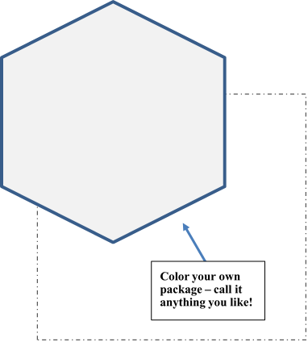
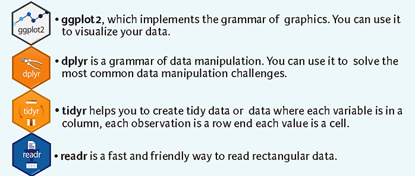

__Speakers:__ _Melinda Ronca-Battist, Dorian Kvale, Kristie Ellickson_


```{r setup, include=F, echo=F, eval=T}

library(rmarkdown)
library(knitr)
knitr::opts_chunk$set(echo=FALSE)

```

<style>
.col2 {
    columns: 2 200px;         /* number of columns and width in pixels*/
    -webkit-columns: 2 200px; /* chrome, safari */
    -moz-columns: 2 200px;    /* firefox */
}

hr {margin-top: 6px; font-weight: 700; color: #696969;}

p {font-size: 120%;}

h3 {margin-top: 32px;}

.big {font-size: 24px; font-weight: 500; color: #2d2d2d;}

code {color: purple; font-size: 15px;}

</style>

<hr size="18">


<br>

<div class="col2">

<h3 style="margin-top: 0;"> Follow along online </h3>

---

`https://mpca-air.github.io/NTF_learn_R/NTF_Demo.html`

<br><br>


<h3 style="margin-top: 0;"> Install R </h3>

---

`https://mpca-air.github.io/NTF_learn_R/00_Install.html`

<br>

</div>


<h3 style="margin-top: -12px;"> Upcoming R Training! </h3>

---

<div class="col2">

- 2-Day hands-on course
- Using real air monitoring data


- Includes criteria pollutants and air toxics
- Make charts, maps, and pollution roses

</div>

_Contact Melinda for more information._


### Previous training materials :: _R Camp!_

---

Tutorials and workshops online at `https://MPCA-air.github.io/RCamp`


### Resources for learning R

---

<div class="col2">

- RStudio: `https://www.rstudio.com/online-learning/`
- `library(swirl)` for interactive lessons in R
- Intro to R with Pirates! at `http://tryr.codeschool.com/`
- More pirates at `YaRrr! Pirates Guide to R`
- Coursera data science: `https://www.coursera.org/jhu`


- R for Data Science by Hadley - `http://r4ds.had.co.nz/`
- R Bloggers articles at `https://www.r-bloggers.com/`
- `#rstats` on Twitter
- R cookbooks at `cookbook-r.com` (a variety of simple recipes for data and charts)

</div>


### A guide for Air data methods

---

We’ve started an online community guide for air data analysis methods. We use it as a resource to provide similar methodologies to calculate means, compare sites, and other common air data tasks. Everyone is invited and encouraged to contribute. It is shared online at `https://mpca-air.github.io/air-methods/`. 





### Shiny tools in presentation

---

Wind pollution roses: `https://air-data.shinyapps.io/pollution-roses/`


### Key terms

---

`package` An add-on for R that contains new functions someone created to help you. It’s like an App for your phone.

`library` The name of the folder that stores your R packages.

`script` A text file used to record the step-by-step instructions of your data analysis.

`RStudio` A helpful user interface that organizes your data, charts, R scripts and packages into one bundle. 


<br>

### R Packages in presentation

---

__Core packages__

{width="64%" style="margin-bottom: 0px; max-width: 64% margin-top: 0px;"}

<br>

<div class="col2">

__Data reading__

* `library(readxl)`

__Air specific analysis and charts__

* `library(openair)`

__Data processing and cleaning__

* `library(tidyverse, lubridate)`


__Charts__

* `library(ggbeeswarm, waffle, ggpomological)`

__Maps__

* `library(leaflet, sf)`

__Interactive tools__

* `library(shiny)`

__Just for fun__

* `library(weatherAlerts, cowsay)`


__Dynamic documents with charts__

* `library(rmarkdown)`

</div>


### Sample air data - `data_2015` 

---

<div>

```{r, echo=F, warning=F, message=F, out.width="100%", fig.width=30}
library(dplyr)

data_2015 <- readxl::read_excel("data/Hourly/AQS_1hr_FondduLac.xlsx", sheet= "2015")

data_2015 <- select(data_2015, site_catid, Year, Date, Hour, Parameter, Conc, everything(), -Time, -StateCode, -CountyCode, -SiteNum)

options(digits=4)

knitr::kable(head(data_2015, 3))

```

</div>


### Sample R commands

```{r, eval=F, echo=T}
# Load Excel data
read_excel("air_data.xlsx")

# Scatterplot of Ozone vs. Temperature
ggplot(data, aes(y = O3_ppm, x = Temp_F)) + geom_point()

# Filter data
filter(data, Concentration > 99, site == "Big Woods Monitor")

# Add new column to data
mutate(data, O3_ppb = O3_ppm * 1000)
```


### Contacts

---

Melinda Ronca-Battista: `Melinda.Roncabattista@gmail.com`  
Kristie Ellickson: `Kristie.Ellickson@state.mn.us`  
Dorian Kvale: `Dorian.Kvale@state.mn.us`  

